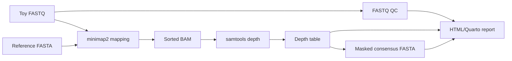

# Viral Genomics Nextflow Demo

[](https://github.com/adnanhaider81/viral-genomics-nextflow-demo/actions/workflows/nextflow-smoke-test.yml)

Small nf-core-style demonstration repository for viral genomics workflow structure. It converts a toy FASTQ dataset into a QC summary, mapped BAM, depth table, masked consensus FASTA, and HTML plus Quarto-ready report.

This is a portfolio/training repository. The bundled data are synthetic and intentionally tiny so the workflow can run quickly in GitHub Actions.

## Workflow overview



## Repository layout

- `main.nf` - DSL2 workflow entry point.
- `modules/` - one process per workflow step.
- `conf/base.config` - default local resource settings.
- `conf/docker.config` - Docker execution profile.
- `conf/slurm.config` - SLURM profile template for HPC clusters.
- `scripts/` - small Python utilities used by workflow processes.
- `test_data/` - synthetic reference FASTA and FASTQ input.
- `.github/workflows/nextflow-smoke-test.yml` - CI smoke test.

## Quick start

Install Nextflow and run locally if `minimap2`, `samtools`, and Python 3 are already available:

```bash
nextflow run .
```

Run with Docker:

```bash
docker build -t viral-genomics-nextflow-demo:local .
nextflow run . -profile docker --container viral-genomics-nextflow-demo:local
```

## Main outputs

- `results/qc/toy_sample.qc.tsv`
- `results/bam/toy_sample.bam`
- `results/bam/toy_sample.bam.bai`
- `results/depth/toy_sample.depth.tsv`
- `results/consensus/toy_sample.consensus.fasta`
- `results/report/toy_sample.report.html`
- `results/report/toy_sample.report.qmd`

## Why this repo exists

My other public repositories show Snakemake-heavy pathogen-genomics workflows. This repository demonstrates the same applied surveillance thinking in a compact Nextflow structure: modular processes, profiles, container execution, test data, and CI.

## Data policy

No clinical, surveillance, or restricted data are included. Keep real FASTQs, BAMs, and reports outside this repository unless they are approved for public release.

## Citation

Haider SA. Viral Genomics Nextflow Demo. Zenodo-ready software repository. See `CITATION.cff`.

## License

MIT. See `LICENSE`.
